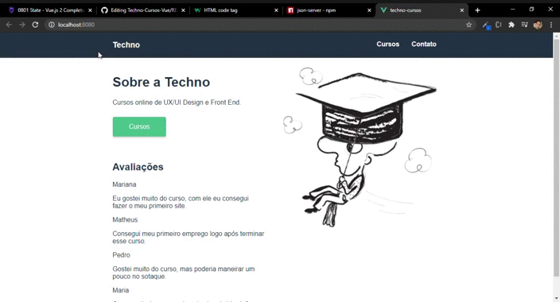

<h1>Techno Cursos</h1> 

<h2>Projeto criado durante o curso de Vue Js2</h2>

Projeto criado utilizando dos conceitos aprendidos no curso, tais como o uso de Hooks, transitions, routers, components, props, entre outros.

Basicamente é um site de cursos online onde o aluno pode acessar os cursos disponíveis pelos links, todas as informações são puxadas da Api disponível
no pacote, a mesma é servida pelo JSON SERVER que simula uma API REST.

Para executar o projeto, após fazer o <strong>Fork</strong> do projeto deve-se executar o npm para puxar os pacotes utilizados, então no bash ou qualquer linha de comando digite:

<code>npm install</code>

Assim que completar, deve-se também ter o pacote JSON Server instalado para simular a api do projeto como uma API REST falsa, para instalar basta digitar:

<code>npm install -g json-server</>

Concluída a instalação, pode executar o mesmo através do comando:

<code>json-server --watch api.json</code>

Agora pode executar o projeto com:

<code>npm run serve</code>
